# **1\. 项目概述**

## 1.1 项目背景

在现代社会中，情感和心理健康越来越受到关注。随着生活节奏的加快和压力的增加，许多人面临情绪波动和心理健康问题。为了帮助人们更好地理解和管理自己的情绪，情绪分析助手应运而生。该项目旨在提供一款用户友好的工具，帮助用户自主检测和分析自己的情绪状态，以便更好地应对生活中的挑战。

当我们谈到情绪时，不可否认它们在我们的生活中扮演着重要的角色。情绪不仅影响我们的思维方式和行为，还关系到我们的心理健康和人际关系。很多时候，个体并不清楚自己情绪的根源，可能会因为情感压抑或误解而导致更大的心理负担。情绪分析助手的开发，正是为了填补这一空白，提供一个简单而有效的工具，让用户能够随时随地了解自己的情感状态。

情绪分析助手的核心理念是自我检测与自我反思。通过简洁明了的界面和交互设计，用户可以轻松地记录自己的情绪，选择对应的情感标签，甚至撰写简要的情感日志。这种方式不仅能帮助用户识别当前的情绪，还能帮助他们回顾和反思情感变化的过程，进而更好地理解自己的情感模式。通过这种自我检测，用户能够逐渐提高对自身情感的敏感度，从而在情绪波动时更好地进行调节。

情绪分析助手的应用场景非常广泛。无论是学生、职场人士，还是家庭主妇，情绪分析助手都能为他们提供支持。在学习和工作中，压力和焦虑往往是常见的情绪表现。通过及时了解自己的情绪状态，用户可以采取有效的应对措施，从而提升工作效率和学习效果。在家庭生活中，情绪分析助手也能帮助用户更好地处理家庭关系，增进与家人之间的理解与沟通。

在这个信息丰富但也充满压力的时代，情绪分析助手为个体提供了一种自我探索的方式。通过定期的情感记录和分析，用户能够建立起对自身情感的全面认知，这不仅有助于情绪管理，也为他们的心理健康提供了有力支持。

## 1.2 国内外研究进展

人脸情绪识别（FER）技术经历了从基础研究到复杂模型构建与训练的发展历程\[1\]。在这一过程中，研究人员不断探索不同的情绪类别划分方法、构建了多样化的人脸数据集，并提出了多种分析模型来提升情绪识别的准确性。例如，VGG16＿SE＿MLP模型通过改进经典的VGG16卷积神经网络并引入通道注意力机制，实现了对学生微表情分类和情绪评估的显著改善\[2\]。此外，对于基于图像的群体情绪识别，有综述性文献系统梳理了该领域的进展，分类了不同情绪线索和处理方式的模型，并对其特点进行了深入分析\[3\]。这些工作不仅促进了个体情绪状态的理解，也为公共安全、市场营销等实际应用提供了理论支持。

自然语言处理（NLP）领域的情感分析旨在解析文本中蕴含的情绪信息。一项研究采用了“中文分词+token+LSTM模型”的方法对学生评教信息进行情绪分析\[4\]。具体来说，首先对文本进行分词以构建词表并生成数字字典，然后将文本转换为数字列表，最后建立LSTM模型进行训练和评估。结果显示，这种方法能够可靠地预测情绪倾向。另外，为了克服现有方面级情感分析模型忽视语法关系的问题，有研究提出了图卷积网络（GCNs），用以提取局部上下文中的方面词特征\[5\]。更进一步地，TCKGCN模型通过融合语义信息、ConceptNet和SenticNet知识，增强了方面级情感分析的能力\[6\]。这些研究展示了如何利用结构化和非结构化的知识源来增强情感分析的效果，为开发更加智能的语言处理系统提供了新思路。

多模态情感分析结合了文本、图像甚至生物传感器等多种类型的数据，以实现更全面的情感理解。一方面，基于注意力机制的多任务情感分析方法（MTAM）被提出，用于有效提取文本和图像模态特征并进行多模态融合\[7\]。MTAM通过改进哈希标签提取、图像特征挖掘和多阶段训练，验证了其在情感识别中的性能和鲁棒性。另一方面，图文多模态情感分析模型（AMNMD）通过双向跨模态交互和噪声过滤，提升了图文特征的情感识别准确性\[8\]。值得注意的是，FEMI模型专注于对话中的多模态情感识别，通过特征增强的方式挖掘情感和语义信息\[9\]。同时，统一的生物传感器-视觉多模态变换器（UBVMT）解决了生物传感器数据不足的问题，减少了模型参数的同时保持了情感识别的高精度\[10\]。针对驾驶员情绪识别问题，DMERN模型通过文本注意力机制的att-LSTM模型和双线性融合方法（BTF），有效解决了图文特征对齐与融合问题\[11\]。这些研究证明了多模态情感分析在提高情感识别准确性和应用场景多样性方面的潜力。

情感识别技术在特定应用场景中有着广泛的应用前景。在智能课堂环境中，实时监测学生情绪可以帮助教师调整授课策略，提高教学效果\[2\]。例如，通过对学生面部表情的自动分析，教师可以获得即时反馈，进而优化课堂教学。社交媒体平台上，融合图像与文本的情感分析有助于更好地反映公众意见\[面向社交媒体的图像与文本融合情感分析\[8\]。这种应用不仅可以帮助平台管理者了解用户情绪趋势，还可以用于品牌管理和舆情监控。此外，针对聊天机器人或大型语言模型如ChatGPT的情感分析，能够揭示用户的态度和关注点\[ChatGPT大语言模型的评论情感分类预测与主题识别研究\[12\]。通过BERT模型进行情感分类，结合LDA主题聚类和时间序列分析，研究人员能够洞察公众对新兴技术的看法及其随时间的变化模式。这不仅促进了人机交互体验的提升，也为产品和服务的持续改进提供了宝贵的依据。

针对方面级情感分析，有研究提出了双权重图卷积网络模型（DWGCN）和多视图交互学习网络模型（MVILN），分别提升了情感分类的准确性和文本与图像信息的融合效果\[13\]。DWGCN模型通过引入双权重机制，平衡了方面特征与整体语义，从而提高了分类准确性；而MVILN则通过多视图交互学习，增强了不同模态之间的协同作用。这两项研究为解决方面级情感分析中的挑战提供了新的解决方案，并在实验中表现出了优异的结果。

为了应对图文多模态数据中情感表征偏移的问题，一些研究提出了情感表征校准的方法\[14\]。例如，一种情感表征校准的图文情感分析模型通过双向跨模态交互和噪声过滤，提升了情感识别的准确性\[15\]。该模型在两个公开数据集上的实验结果表明，它优于现有的先进方法，为图文情感分析提供了一种有效的解决方案。同样，AMNMD模型也采用了类似的技术路径，但特别强调了注意力机制和动量蒸馏技术的作用，进一步提升了情感分类任务的表现。

## 1.3 本项目工作内容

1.完成数据收集和预处理，并训练模型

2.进行原型软件系统的后端以及前端代码编写

3.对接后端服务器和机器学习服务器

4.单元测试以及系统集成测试

## **参考文献**

1.  居强,胡钊龙,王艳.人脸情绪识别技术及运用分析\[J\].数字通信世界,2024,(05):60-62.
2.  刘芳,李俊吉.融合VGG与注意力的学生微表情识别和情绪评估方法\[J\].现代计算机,2024,30(18):28-33.
3.  高帅鹏,王怡凡.基于图像的
4.  群体情绪识别综述\[J\].计算机与现代化,2024,(08):98-107.
5.  高云,刘寰,周建慧,等.基于自然语言处理的学生评教情绪分析\[J\].山西大同大学学报(自然科学版),2024,40(05):49-55.
6.  Jian D ,Yingxue Z ,Lifen L .Graph Convolutional Networks for Aspect-Based Sentiment Analysis\[J\].Journal of Artificial Intelligence Practice,2024,7(1):
7.  Hao J ,Pei L ,He Y , et al.TCKGCN: Graph convolutional network for aspect-based sentimentanalysiswiththree-channelknowledge fusion\[J\].Neurocomputing,2024,600128163-128163.
8.  郭馨茹.基于文本和图像的多模态情感分析方法研究\[D\].电子科技大学,2022.DOI:10.27005/d.cnki.gdzku.2022.003847.
9.  李思奇.面向社交媒体的图像与文本融合情感分析\[D\].北京邮电大学,2023.DOI:10.26969/d.cnki.gbydu.2023.000187.
10.  Fu Y ,Yan X ,Chen W , et al.Feature-Enhanced Multimodal Interaction model for emotionrecognitioninconversation\[J\].KnowledgeBasedSystems,2025,309112876-112876.
11.  Ali K ,Hughes E C .A Unified Biosensor–Vision Multi-Modal Transformer network for emotion recognition\[J\].Biomedical Signal Processing and Control,2025,102107232-107232.
12.  Xiang G ,Yao S ,Wu X , et al.Driver multi-task emotion recognition network based on multi-modal facial video analysis\[J\].Pattern Recognition,2025,161111241-111241.
13.  朱益平,慕钰,孙逸宁.ChatGPT大语言模型的评论情感分类预测与主题识别研究\[J/OL\].情报科学,1-35\[2024-12-28\].http://kns.cnki.net/kcms/detail/22.1264.G2.20241227.0935.008.html.
14.  庞文倩.基于深度学习的方面级情感分析研究\[D\].兰州理工大学,2023.DOI:10.27206/d.cnki.ggsgu.2023.000262.
15.  李振.基于图文多模态的情感分析方法研究\[D\].哈尔滨工业大学,2022.DOI:10.27061/d.cnki.ghgdu.2022.002336.
16.  张顺香,刘佳佳,焦熠璇,等.基于情感表征校准的图文情感分析模型\[J/OL\].北京航空航天大学学报,1-14\[2024-12-28\].https://doi.org/10.13700/j.bh.1001-5965.2024.0545.

# **2\. 系统设计**

## 2.1 需求分析

如下图1为情绪助手的系统用例图，主要参与者为用户，包括注册登录、情绪识别、记录统计、文章推荐等功能。

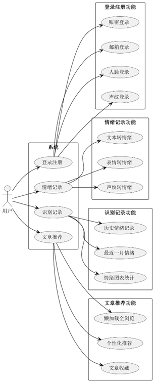

图1 用例图

1.  登录注册：账密登录、邮箱登录、人脸登录、声纹登录。
2.  情绪识别：包括文本转情绪、表情转情绪、声纹转情绪。
3.  记录统计：历史情绪记录、最近一月情绪、情绪图标统计。
4.  文章推荐：懒加载全浏览、个性化推荐、文章收藏。

非功能性需求：

1、性能需求描述：

1)响应时间

(1).在95％的情况下，一般时段响应时间不超过1.5秒，高峰时段不超过4秒。

(2).在推荐配置环境下：登录响应时间在2秒内，刷新响应时间在2秒内，打开信息条目响应时间1秒内，刷新部门、人员列表响应时间2秒内。

(3).在非高峰时间根据编号和名称特定条件进行搜索，可以在3秒内得到搜索结果。

2)资源使用率

(1)CPU占用率<=50%。

(2)内存占用率<=50%。

2、安全需求描述

1)严格权限访问控制，用户在经过身份认证后，只能访问其权限范围内 的数据，只能进行其权限范围内的操作。

2)不同的用户具有不同的身份和权限，需要在用户身份真实可信的前提 下，提供可信的授权管理服务，保护数据不被非法/越权访问和篡改，要确 保数据的机密性和完整性。

3)系统采用登录保护，进行敏感性操作的时候会验证登录者身份。

3、可测试性需求描述

1)一个模块的最大圈复杂度不能超过15。

2)交付的系统必须通过单元测试，并且是100%覆盖。

3)开发活动必须回归测试，并允许在12小时内重新进行完整的测试。

4、可维护性需求描述

1)90%的BUG修改时间不超过1个工作日，其他不超过2个工作日。

2)安装新版本必须保持所有的数据库内容和所有个人设置不变。

3)产品必须提供可跟踪任何数据库字段的工具。

## 2.2 系统架构

 如下图2所示，是情绪助手的系统逻辑架构图，前端界面向Contoller发出请求，Service调用mapper查询数据库或调用Flask后端进行处理，处理完之后封装成Result通用返回类响应给前端，前端进行展示：

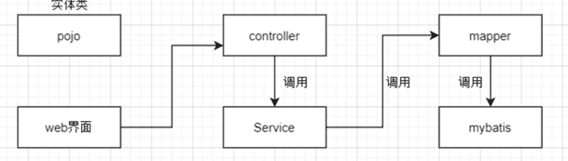

图2系统逻辑架构图

系统物理架构图如下图3所示，采用的是BS架构，PC或手机的浏览器端向服务器发送请求，服务器通过调用API或数据库完成请求，如有需要后端服务器还需要调用AI服务器完成请求：

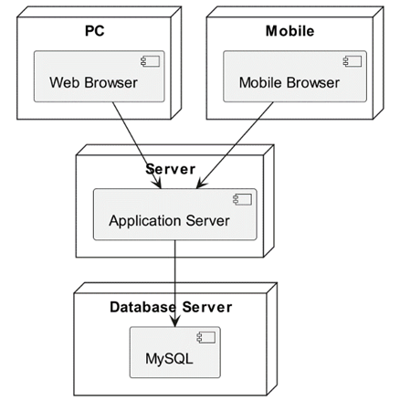

图3 系统物理架构图

## 2.3 数据库设计

如下图4为数据库E-R图：

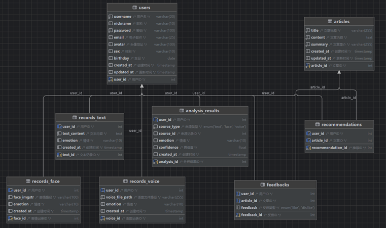

图4 E-R图

1.  数据出处：公开数据集、内部生成数据。
2.  数据类型

文本数据：包括社交媒体帖子、电子邮件、聊天记录、产品评论、调查问卷回答等。

语音数据：录音片段，例如电话客服对话、会议录音、个人语音日记等。

视觉数据：图片和视频中的人脸图像，用于识别面部表情和肢体语言。

1.  数据范围

时间范围：数据覆盖的时间段从各个数据集的创建时期到最近的更新日期不等。

地理区域：全球范围内，但主要集中在使用英语、汉语、西班牙语和其他主要语言的地区。

人群特征：涵盖不同年龄、性别、文化背景和社会经济地位的个体。

# **3\. 算法设计**

## 3.1 数据获取与预处理

我们使用的数据集来自开源网站Hugging Face所提供的数据集，Hugging Face是一个提供大量机器学习模型和数据集的平台，其中也包括了各种的数据集例如图片、文本等。不过，在使用这些数据集时，必须注意遵守相关的隐私法规和道德规范，比如GDPR（欧盟的一般数据保护条例）等。但是声纹数据目前未发现开源数据集，所以采集的是小组成员的声纹信息。例如：

VGGFace2是一个大规模的人脸识别数据集，包含9131个人的面部。 图像从Google图片搜索下载，在姿势，年龄，照明，种族和职业方面有很大差异。该数据集于2015年由牛津大学工程科学系视觉几何组发布，相关论文为Deep Face Recognition。

Twitter Emotion Dataset该数据集是从Twitter上抓取的推文，并根据情绪进行了标注，如愤怒、恐惧、喜悦、悲伤等，适用于更细致的情绪分类任务。

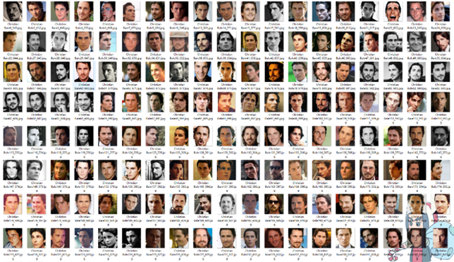

图5 人脸识别数据集

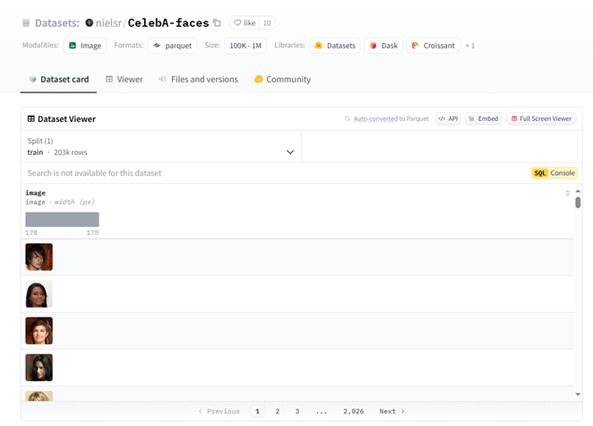

图6 文本情绪分类数据集

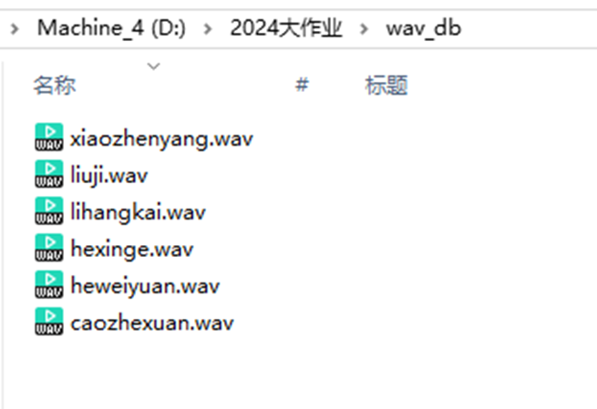

图7 声纹数据集

## 3.2 特征计算与分析

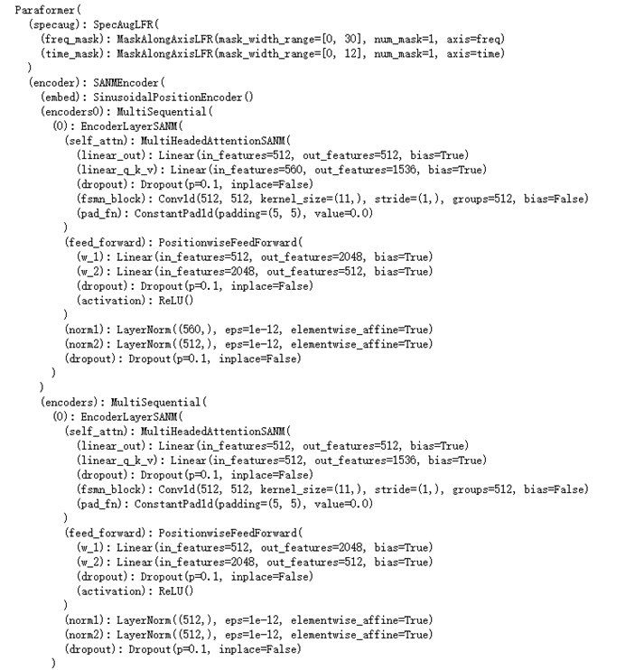

图8 语音转文本模型

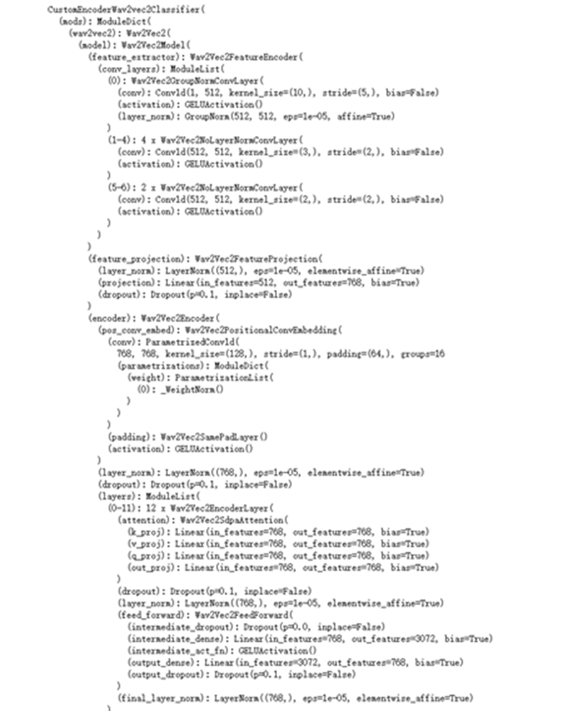

图9 语音情绪识别模型

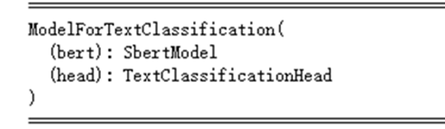

图10 文本情绪识别模型

## 3.3 分类与预测

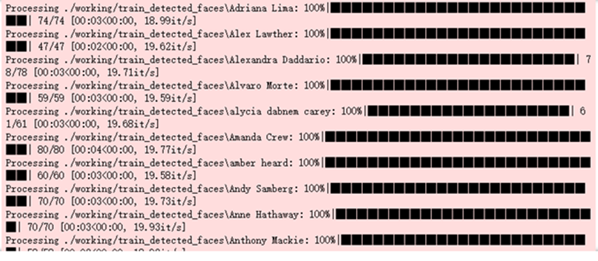

图11 训练结果一

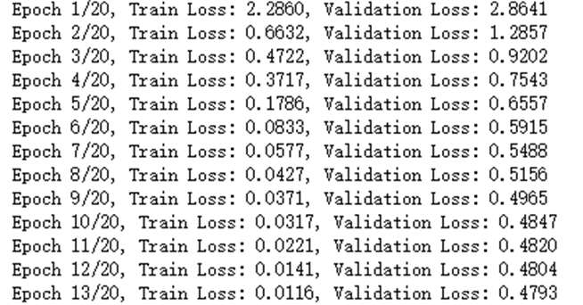

图12 训练结果二

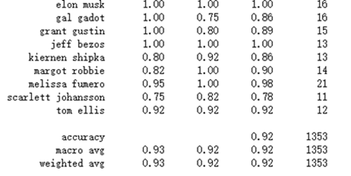

图13 训练结果三

# **4\. 系统实现**

## 4.1 开发环境

JAVA代码编写：IDEA、JDK17

Python代码编写：jupyternotebook、torch、opencv

前端代码编写：vscode、IDEA

数据库：mysql 8.0.32、Redis-x64-5.0.14.1

其它：Spring2.6.5、Thymeleaf3.0.15、mybatis-plus3.5.2、druid1.1.23

## 4.2 系统功能及实现

登录：包括账号密码登录、邮箱登录、人脸登录、声纹登录四种方式；注册时，只能自己设置用户名和密码注册，注册成功之后可以补充录入信息，以实现其他登录方式，如下图所示。

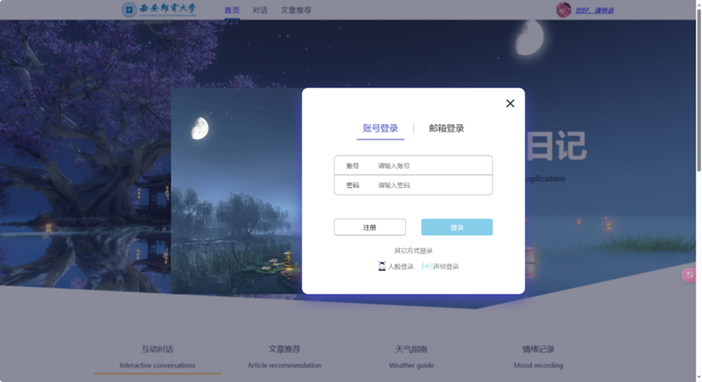

图14 登录注册界面

情绪识别：包括文本情绪识别，表情情绪识别，声音情绪识别三种，如下图所示。同时，识别历史也可以通过历史记录按钮进行查看。

图15 情绪识别

除此之外，识别出的结果也进行了统计，如下图所示，可以按照日期来查看最近一个月某日的情绪结果，也通过饼状图和柱状图进行了统计展示。

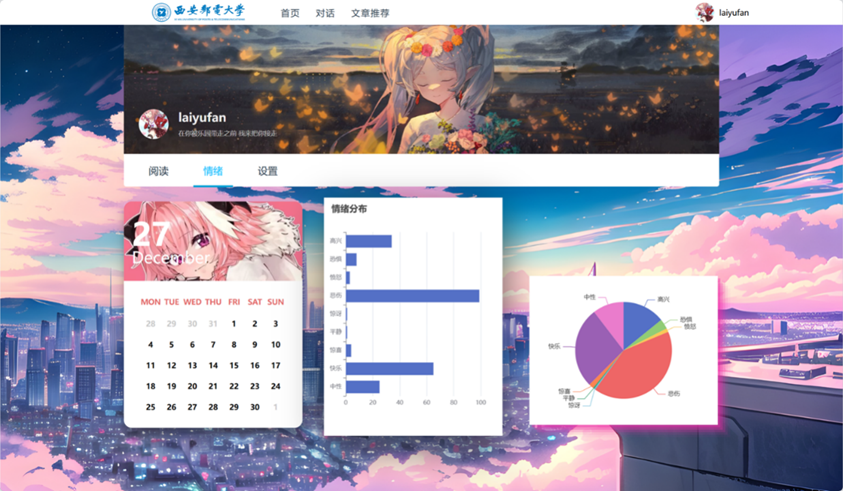

图16 情绪统计

文章展示：文章按照用户当日情绪，选择适当的文章进行轮播，如下图所示，同时还可以通过左侧按钮懒加载文章，如下图所示。

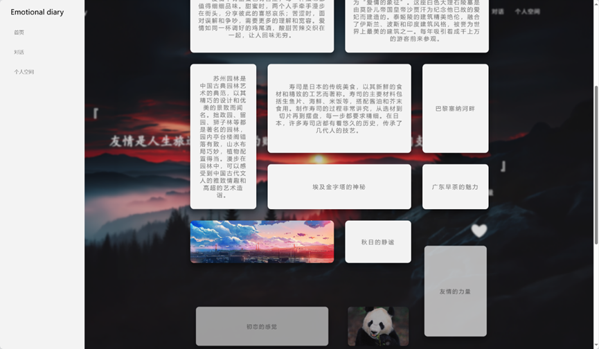

图17 懒加载文章

其中，在轮播页对文章可以进行收藏，如图中红心按钮，收藏之后可以在个人主页进行查看。

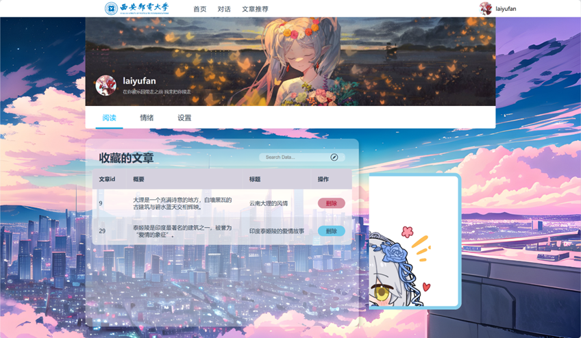

图18 收藏文章

# 5\. 项目总结

## 5.1 项目小结

（1）本项目工作内容小结；

智能识别与推荐：基于Spark框架提供AI服务接口，完成多种情绪识别的功能。

功能模块实现：开发了生物信息登录、文章推荐与收藏、识别统计等模块。

安全性与性能优化：引入JWT验证、MD5加密、Redis缓存和ThreadLocal机制，提升系统安全性和多线程处理能力。

系统架构设计：采用分布式架构，将前端、后端、AI端及数据库端解耦，利用内网穿透技术实现高效通信。

1.  本项目成果小结；

核心功能实现：系统已支持智能情绪识别、识别结果统计展示、文章推荐、声纹与人脸登录、用户收藏管理等关键功能。

系统稳定性与安全性提升：通过分布式架构和多层安全措施，系统在性能、并发处理能力和数据安全性方面表现优异。

用户体验优化：前端设计美观，交互流畅，支持个性化推荐和多样化功能，初步满足用户需求。

1.  本项目的特色与创新之处：

阿里云OSS：将用户生物信息存储在阿里云对象存储中，方便跨平台调用，同时增强数据持久性与安全性。

ThreadLocal机制：通过ThreadLocal存储token，通过解析token获得用户信息，确保多线程环境下的数据隔离与线程安全。

分布式架构：将前端、后端、AI端和数据库端分离，结合内网穿透技术实现高效的分布式数据通信。

Spark集成：Python后端使用Spark框架提供AI服务接口，方便Java后端的高效调用与扩展，实现智能化功能。

JWT令牌：用户登录后生成唯一的JWT token，传递给前端用于身份验证，确保用户会话安全。

MD5加密：对用户密码进行MD5算法加密，增加存储安全性，有效防止信息泄露。

Redis缓存：利用Redis临时存储邮箱验证码和JWT token，支持定时清除机制，降低信息泄露风险。

1.  本项目后续工作计划。

Java后端：梳理后端业务逻辑，精简代码结构，删除冗余逻辑，提升代码复用性与维护效率。

Vue前端：优化前端逻辑，减轻前端处理压力，提升页面响应速度，进一步改善用户体验。

AI后端：改进声纹识别算法，提高识别速度，优化情绪识别模型，提高识别准确度，为用户提供更高效的使用体验。

## 5.2 团队组织管理小结

本次情绪助手项目由我们超级飞侠团队的五位成员共同开发。鉴于时间紧迫以及团队成员各自专业领域的差异，我们采用了分布式开发模式，各自承担不同的开发任务，并通过接口文档实现数据的交流与整合。在开发过程中，曹哲轩主要负责系统架构设计以及Java后端开发；李航凯则专注于AI后端训练和接口开发；赖宇凡负责Web前端的开发工作；刘吉和何维远则主要负责数据库设计、数据收集与处理以及测试等环节。我们利用“飞书云文档”来跟踪项目进度，并通过Git进行代码管理。

项目开发期间，我们定期进行测试，确保能够及时发现并迅速解决潜在问题，从而保障项目的顺利推进。在开发的后期阶段，我们集中精力于业务流程的开发和完善，并尝试引入一些创新性的功能。通过持续的学习和探索，我们不仅完善了系统功能，还提升了系统的稳定性和用户体验。

在整个开发流程中，不断的讨论和沟通促进了团队成员之间的相互学习和互助合作，共同克服了诸多挑战。这种团队协作精神是我们能够成功完成项目的根本保证。

# 6\. 团队成员总结

## 6.1 团队人员曹哲轩个人总结

### 6.1.1开发任务

本次项目，我主要负责系统的整体规划、后端开发、模块对接及BUG修复等核心任务。同时，我还为系统设计并实现了多项亮点功能，包括引入Redis缓存数据库以提升性能，使用ThreadLocal机制确保线程安全，集成JWT令牌实现用户认证，及采用阿里云OSS安全存储用户数据等，这些功能显著增强了系统的稳定性和安全性。

在这次项目开发中，我完成了系统架构设计、接口开发与对接，并实现了多项创新功能。通过设计分布式架构，我有效提升了系统的扩展性和维护性；在接口开发方面，我确保了后端与前端及AI模块的对接；引入Redis实现临时存储与定时删除功能，优化了系统响应速度；利用ThreadLocal机制保障了多线程环境下的安全性；通过JWT认证增强了用户身份验证的便捷性和安全性；此外，阿里云OSS的集成也为用户数据的安全存储和便捷调用提供了可靠保障。

我们高度重视团队协作，各司其职并相互支持。与赖宇凡相互协助，解决了跨域请求的问题，实现了拦截器，与李航凯合作解决了Java后端与Spark框架的信息沟通问题等，通过多次讨论与测试解决了技术难点。在对接阶段，团队紧密合作，通过接口文档的标准化处理确保了各模块的无缝衔接。项目后期，我们通过多轮集成测试与优化，及时解决问题并提升系统性能，确保项目按计划顺利完成。

通过这次项目开发，我的技术水平得到了显著提升，掌握了更多开发技能；团队合作能力也有了较大提高，尤其是在解决复杂问题和推动项目进展方面。同时，我的独立问题解决能力在应对技术和逻辑难题的过程中得到了锻炼。然而，项目也暴露出一些问题，如需求分析不够全面导致后期频繁修改、测试环境配置不当造成时间浪费，以及文档与沟通不足引发的进度延迟。未来，我将更加重视需求分析和系统设计，优化开发与测试环境配置，并强化文档记录和团队沟通，以提升项目开发的效率与质量。

## 6.2 团队人员李航凯个人总结

本人的开发任务为提供项目可靠的AI服务，大体的的AI服务有，声纹识别，人脸识别，多模态情绪识别（文字情绪识别，声音情绪识别，人脸情绪识别）。

前期根据项目需求查找相关资料，找出适合任务的模型结构、对应的训练数据，以及开源社区与训练好的模型——为预防自己训练模型效果不理想的备用计划。本人指导刘吉前期对训练数据的查找，以及对人脸识别模型训练。

中期训练好多模态情绪识别的相关模型，以及声纹识别模型。文字情绪识别模型使用主流的BERT作为骨干网络，使用self-attention结构作为分类器，训练好的文字情绪识别模型效果理想。人脸情绪识别模型使用较新的VIT作为骨干网络，直接使用全连接神经网络作为分类器，得益于VIT使得分类精度很理想。介于本人在音频相关的深度学习方面的缺失，就直接使用目前开源的的模型进行测试，选出了在中文语境下效果最好的两块模型。

图20 人脸情绪分类模型结构

后期将模型部署在服务器环境下，使用python的flask提供AI服务器的后端服务，用于pythonAI服务与Java传统后端不同语言间的数据通信、对Java请求数据的预处理、以及对数据的预测，建立人脸识别声纹识别的数据库。将所有AI模型封装为可调用的函数，在前后端测试的过程中解决对数据预处理的方法。图像预处理主要使用opencv进行基本上没啥大问题，而后端接收到的音频的格式与模型要求有很大不符，需要使用ffmpeg来调整音频的格式、码率、声道。最后将预测数据打包返回给Java后端。

本人在这次项目中学到了音频模型相关的一些知识，以及对前后端的合作的感触更深，提高了自己在提供AI服务的技术。

## 6.3 团队人员赖宇凡个人总结

## 6.4 团队人员何维远个人总结

在本次项目中，我主要负责了数据库的搭建、后端 POJO 类与 Mapper 类的开发、数据的增删改查操作以及项目的测试工作。通过这些任务的完成，我不仅确保了系统的稳定性和高效性，还积累了丰富的实践经验。

首先，在数据库搭建方面，我设计并实现了项目的数据库结构，确保其能够高效地存储和管理用户、文章、分析结果、反馈、推荐以及不同类型记录（如文本、面部表情和语音）的数据。我创建了多个表，包括 users、articles、analysis_results、feedbacks、recommendations、records_face、records_text 和 records_voice，并为每个表定义了适当的字段、约束和索引。为了确保数据的一致性和完整性，我使用了外键约束，并为每个表添加了创建时间和更新时间字段，设置了默认值和自动更新功能。此外，我还特别注意了数据库的性能优化，例如为常用的查询字段创建索引，以提高查询效率。我还编写了详细的数据库设计文档，方便后续的维护和扩展。接下来，在后端开发方面，我编写了与数据库表对应的 Java POJO 类，并使用 MyBatis-Plus 和 Lombok 简化了代码逻辑。Lombok 的 @Data 注解自动生成了 getter、setter、toString()、equals() 和 hashCode() 方法，减少了样板代码。在数据的增删改查操作方面，我使用 MyBatis-Plus 提供的通用 CRUD 方法，简化了常见的增删改查操作。同时，我为每个实体类编写了自定义的查询方法，处理复杂的业务逻辑。为了确保数据的一致性和完整性，所有增删改查操作都符合事务管理要求。

在项目测试方面，我通过集成测试对整个系统的健壮性和可用性进行了全面评估。例如，在测试拍照上传和录音上传功能时，我发现了一个潜在的问题：由于拍照提交与录音提交绑定的是同一个事件，导致用户先点击拍照提交再点击录音提交时，系统会重复发送请求。这个问题不仅影响了用户体验，还可能导致数据冗余或不一致。为了解决这一问题，我与负责前端开发的同学进行了沟通，并详细描述了问题的重现步骤和可能的原因。经过讨论，我们决定由前端同学进行修改，确保拍照提交和录音提交分别绑定独立的事件，避免重复触发。前端同学迅速响应并修复了这个 bug，经过再次测试，系统能够正常运行，用户可以顺利地完成拍照和录音的上传操作，且不会出现重复提交的情况。此外，我还进行了其他方面的集成测试，确保各个模块之间的协同工作正常。例如，我测试了用户注册、登录、文章发布、反馈提交等功能，验证了系统的各项功能是否符合需求。通过这些测试，我发现并修复了多个潜在问题，进一步提高了系统的稳定性和可靠性。

## 6.5 团队人员刘吉个人总结

作为本小组的组长，我在项目中不仅负责一部分技术层面的工作包括数据收集、预处理和模型训练，还承担着整体进度管理、团队协作和任务分配等非技术性职责。

在项目初期，我进行了广泛的市场调研，深入了解了国内外情绪分析产品的现状和发展趋势。通过文献综述、在线资源搜索以及亲自使用各种类似APP等方式，收集并分析了大量的资料。例如，国外的产品如Affectiva、Realeyes等已经在广告测试、市场研究等领域取得了显著成果，它们利用先进的计算机视觉和自然语言处理技术，提供实时的情绪反馈服务。国内市场上，像科大讯飞的情感计算平台也逐渐崭露头角，专注于智能客服、心理健康监测等方面的应用。通过对这些产品的深入剖析，我们明确了自身的优势和差异化发展方向，即聚焦于用户友好的交互体验和个人情绪管理辅助工具的开发。

在数据收集阶段，我们从多个渠道获取高质量的数据集。我们主要依赖于Hugging Face提供的公开数据集，这些数据集涵盖了文本、和图像等多种类型的情绪表达样本，具有广泛的代表性和应用价值。在文本情绪识别方面，我们选择了包含大量中文评论的情感分类数据集，比如Twitter Emotion Dataset，该数据集是从Twitter上抓取的推文，并根据情绪进行了标注，如愤怒、恐惧、喜悦、悲伤等，适用于更细致的情绪分类任务；对于人脸表情识别，则选取了几何多样性丰富的人脸图片集，包括MS-Celeb-1M，VGGFace2 LFW，CelebA等一些知名数据集。此外，为了解决音频数据的缺失，我们小组每个人都贡献了自己的音频信息，用于声纹情绪识别的研究。

数据预处理是确保后续模型训练效果的关键步骤。针对不同类型的数据源，我制定了详尽的清洗策略。对于文本数据，首先进行了分词处理，并使用jieba库对中文文本进行了精准切分；接着移除了停用词和HTML标签等无关信息，最后将文本转换成数字向量表示，以便输入到神经网络中。在处理语音数据时，考虑到不同录音设备造成的音频格式差异，我引入了ffmpeg工具进行统一编码，确保所有音频文件都符合模型要求。同时，利用Librosa库提取MFCC特征，为声纹情绪识别提供了有效的声学表征。至于图像数据，采用了OpenCV库实现了标准化操作，如调整分辨率、裁剪对齐面部区域等，以提高人脸识别的准确性。

对于文本情绪识别部分，基于BERT（Bidirectional Encoder Representations from Transformers）模型的强大语言理解能力，结合self-attention机制构建了一个高效的分类器。通过微调预训练的BERT权重，使模型能够更好地适应我们的特定任务需求。在人脸情绪识别方面，选用Vision Transformer（VIT）作为骨干网络，相较于传统的卷积神经网络，VIT可以捕捉更复杂的视觉模式，从而显著提升了分类性能。至于声纹情绪识别，我们采用目前开源社区中表现优异的模型——Wav2Vec 2.0，并根据中文语境进行了针对性优化，确保其在实际应用场景中的适用性。

在训练过程中，我特别注重实验设计的严谨性和结果验证的有效性。建立了严格的交叉验证机制，确保每次迭代都能获得稳定可靠的评估指标。同时，为了防止过拟合现象的发生，采取了一系列正则化措施，包括Dropout层设置、L2正则项添加等。此外，我还积极关注最新的研究成果和技术动态，及时引入新的算法改进方案，如尝试使用对抗训练方法增强模型鲁棒性，或探索多模态融合技术提升综合识别能力。

在整个项目周期内，我积极协调各方计划和资源，确保项目按计划顺利推进。此外，我们小组每周都有一次会议，除了跟踪每位成员的工作进展，调整任务分配，还能及时解决一些分散的难题。特别是在项目后期，整体项目流程的完善以及系统测试都需要所有成员的参与。

在此次创新综合实践项目中，我实践了也新学到了很多东西，尤其是在自然语言处理和机器学习领域，对于我后面的毕业设计也有颇多助益。这段经历极大地锻炼了我的领导能力和团队协作精神。然而，在项目实施过程中也出了一些问题，如初期需求分析不够深入导致后期频繁修改、测试环境配置不当造成时间浪费、问题频发等。后面，我将继续加强需求调研和技术水平，优化开发流程和团队协作，以更好地应对复杂项目带来的挑战。
