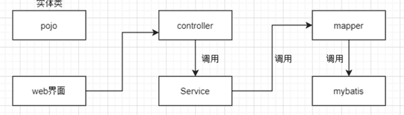
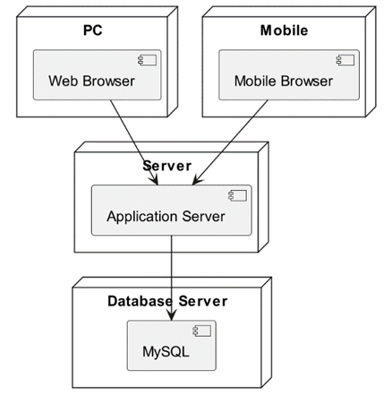
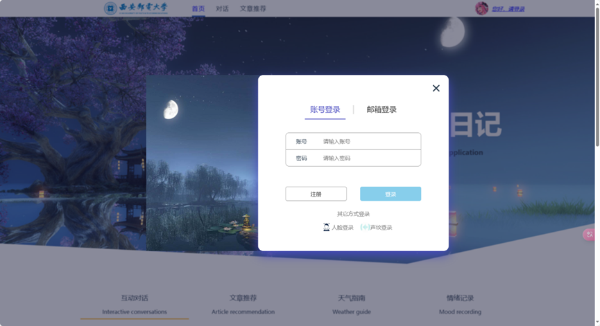
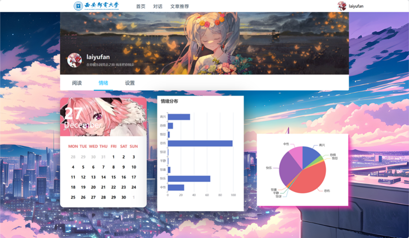
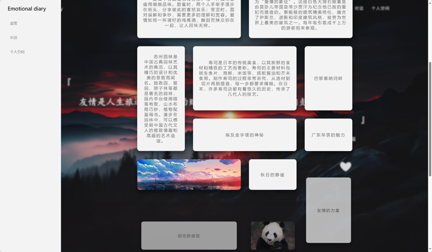

# EMAS · 情绪分析助手

> **E**motion **M**anagement & **A**nalysis **S**ystem —— 一个面向个人情绪自检与心理健康的多模态情绪分析平台。

EMAS 通过 **文本、人脸、语音** 三种模态识别用户情绪，提供识别历史统计、个性化文章推荐与收藏、以及账号密码 / 邮箱验证码 / 人脸 / 声纹等多种登录方式。系统采用前后端分离 + 独立 AI 服务的分布式架构。


---

## 目录

- [功能特性](#功能特性)
- [系统架构](#系统架构)
- [技术栈](#技术栈)
- [目录结构](#目录结构)
- [快速开始](#快速开始)
- [接口说明](#接口说明)
- [界面预览](#界面预览)
- [文档](#文档)
- [团队成员](#团队成员)
- [说明与注意事项](#说明与注意事项)

---

## 功能特性

| 模块 | 说明 |
| --- | --- |
| 🔐 多方式登录 | 账号密码登录、邮箱验证码登录、人脸登录、声纹登录；注册后可按需补录生物特征 |
| 😊 多模态情绪识别 | 文本转情绪、表情转情绪、声纹转情绪三种识别能力 |
| 📊 记录与统计 | 历史情绪记录、最近一个月情绪趋势、饼图 / 柱状图统计展示 |
| 📰 文章推荐 | 根据当日情绪进行个性化推荐、懒加载浏览、文章收藏 |
| 🧑 个人中心 | 用户信息与头像维护、密码修改、账号注销 |

---

## 系统架构

系统采用 **前端（Vue）→ 后端（Spring Boot）→ AI 服务（Flask）** 的分层分布式架构：
前端通过 `/api` 代理请求后端；后端经 Service 层调用 Mapper 访问 MySQL / Redis，或通过 HTTP 调用 Flask AI 服务；用户生物特征等文件存储于阿里云 OSS；最终统一封装为 `Result` 通用返回体响应前端。

<p align="center">
  
  <br/><sub>系统逻辑架构图</sub>
</p>

<p align="center">
  
  <br/><sub>系统物理架构图（BS 架构）</sub>
</p>

---

## 技术栈

**前端 `EMAS_VUE`**

- Vue 2.6 · Vue Router 3 · Vuex 3
- Element UI 2.15 · ECharts 5 · Axios · Less
- Vue CLI 5（Babel / ESLint）

**后端 `EMAS_JAVA`**

- Spring Boot 2.6.5 · JDK 17
- MyBatis-Plus 3.5.2 · Druid 1.1.23
- MySQL 8.0 · Redis
- Auth0 java-jwt 4.4.0 · FastJSON · PageHelper · OkHttp / HttpClient
- Lombok · Apache Commons Lang3 · Aliyun OSS SDK · spring-boot-starter-mail

**AI 服务 `EMAS_PY`**

- Python 3.8 · Flask · PyTorch · OpenCV
- 情绪识别模型：**BERT**（文本）、**ViT**（人脸表情）、**Wav2Vec 2.0**（语音）
- 人脸检索：InsightFace；音频预处理：FFmpeg / Librosa

---

## 目录结构

```text
EMAS/
├── assets/            # README 图片与设计图
├── Data/              # 示例音视频数据
├── docs/              # 项目文档（含完整项目报告）
├── EMAS_JAVA/         # Java 后端（历史版本以 zip 快照形式提供）
│   ├── EMAS_10_25.zip
│   ├── ...
│   └── EMAS_12_27.zip # 最新后端源码
├── EMAS_PY/           # Python AI 服务（Jupyter Notebook 实现）
│   ├── flask_emo_face_post.ipynb
│   ├── flask_emo_face_request.ipynb
│   └── text.ipynb
└── EMAS_VUE/          # Vue 前端工程
    ├── public/
    ├── src/
    │   ├── api/       # 接口封装
    │   ├── components/# 页面组件
    │   ├── router/    # 路由与登录守卫
    │   ├── store/     # Vuex 状态管理
    │   ├── utils/     # 工具方法
    │   └── views/     # 页面视图
    └── package.json
```

---

## 快速开始

### 环境要求

| 组件 | 版本建议 |
| --- | --- |
| JDK | 17 |
| Maven | 3.8+ |
| Node.js | 16 / 18 |
| Python | 3.8 |
| MySQL | 8.0 |
| Redis | 5.0+ |

### 1. AI 服务（`EMAS_PY`）

AI 服务以 Flask 形式提供接口，默认监听 `http://127.0.0.1:5000`。

```bash
cd EMAS_PY
# 建议使用虚拟环境
python -m venv .venv && source .venv/bin/activate
pip install flask torch opencv-python insightface soundfile sounddevice requests librosa

# 按需创建并运行 Flask 应用（可直接运行 notebook 或导出为 .py）
jupyter notebook flask_emo_face_post.ipynb
```

> 语音接口依赖 `ffmpeg` 完成采样率 / 声道 / 码率转换，请确保系统已安装。

### 2. 后端服务（`EMAS_JAVA`）

后端源码以版本快照压缩包提供，请解压最新版本后再构建：

```bash
cd EMAS_JAVA
unzip EMAS_12_27.zip -d backend
cd backend

# 1) 准备数据库：导入 src/main/resources 下的 SQL
mysql -uroot -p -e "CREATE DATABASE emas DEFAULT CHARSET utf8mb4;"
mysql -uroot -p emas < src/main/resources/12_16.sql

# 2) 按环境修改 src/main/resources/application.yml
#    - spring.datasource.druid.*      数据库连接
#    - spring.redis.*                 Redis 连接
#    - spring.mail.*                  邮件服务
#    - AI 服务地址（SparkServiceImpl 中的 BASE_PATH，默认指向 Flask 服务）

# 3) 启动
mvn spring-boot:run
# 默认端口 8080
```

### 3. 前端服务（`EMAS_VUE`）

```bash
cd EMAS_VUE
npm install            # 或 yarn install

# 修改 vue.config.js 中的代理目标为你的后端地址
#   devServer.proxy['/api'].target

npm run serve          # 开发模式，默认 http://localhost:9094
npm run build          # 生产构建
npm run lint           # 代码检查
```

---

## 接口说明

### AI 服务（Flask，默认 `:5000`）

| 方法 | 路径 | 说明 |
| --- | --- | --- |
| POST | `/classify_text2emo` | 文本情绪识别 |
| POST | `/predict_facemoe` | 人脸表情情绪识别 |
| POST | `/classify_audio2emo` | 语音情绪识别 |
| POST | `/audio2txt` | 语音转文本 |
| POST | `/detect_faceid` | 人脸检索（人脸登录） |
| POST | `/verify_audioid` | 声纹校验（声纹登录） |

### 后端 REST（Spring Boot，默认 `:8080`）

| 前缀 | 路径示例 | 说明 |
| --- | --- | --- |
| `/login` | `/pwdLogin` `/emailLogin` `/faceLogin` `/voiceLogin` `/sendValidation` | 登录与验证码 |
| `/user` | `/register` `/getUser` `/update` `/updateAvatar` `/updatePwd` `/addFaceInfo` `/addVoiceInfo` `/deleteUser` | 用户管理 |
| `/record` | `/textRecord` `/faceRecord` `/voiceRecord` `/listTextRecords` `/countEmotions` `/getDailyEmotion` | 识别记录与统计 |
| `/article` | `/getRandomArticles` `/getLikedArticles` `/like` `/dislike` `/listRecommends` | 文章推荐与收藏 |

---

## 界面预览

| 登录 / 注册 | 情绪识别 |
| :---: | :---: |
|  |  |

| 情绪统计 | 文章推荐与收藏 |
| :---: | :---: |
|  |  |

---

## 文档

- 📄 [项目报告（需求分析 / 系统设计 / 算法设计 / 团队总结）](./docs/项目报告.md)

---

## 团队成员

| 成员 | 主要职责 |
| --- | --- |
| 曹哲轩 | 系统架构设计、Java 后端开发、模块对接与 BUG 修复 |
| 李航凯 | AI 后端模型训练与 AI 服务接口开发 |
| 赖宇凡 | Web 前端开发 |
| 何维远 | 数据库设计、后端 POJO / Mapper 开发、测试 |
| 刘吉 | 数据收集与预处理、模型训练、项目进度管理 |

---

## 说明与注意事项

- ⚠️ **敏感配置**：`EMAS_JAVA` 内的 `application.yml` 含有数据库与邮箱账号口令示例，请勿提交真实凭据，建议改用环境变量或配置模板。
- 📦 **后端源码形式**：Java 后端以历史版本 zip 快照存放于 `EMAS_JAVA/`，使用前请解压 `EMAS_12_27.zip`（最新版）。
- 🔗 **内网穿透**：代码中出现的 `natappfree.cc` 域名为开发期内网穿透地址，实际部署时请替换为你自己的服务地址。
- 🎓 **项目性质**：本项目为课程 / 创新实践项目，仅用于学习交流。
